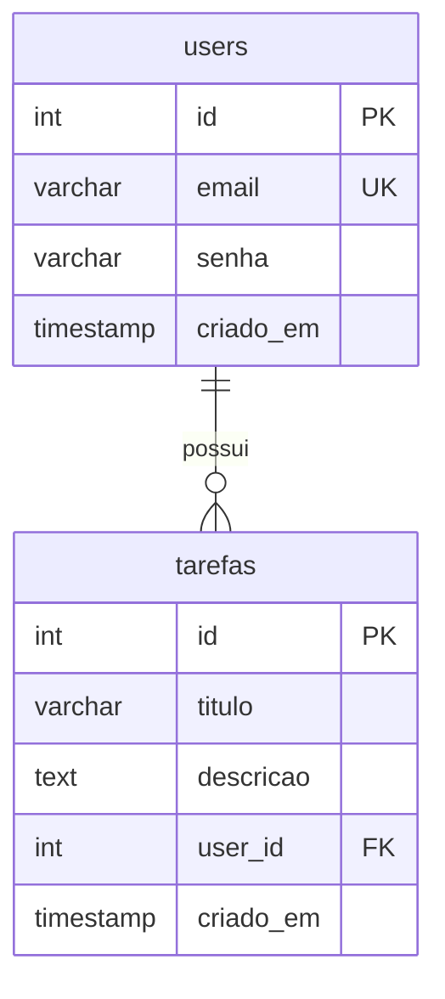

# DER — To-Do List (RF-06)

Relacionamento: **User 1 — N Tarefa**  
Cada tarefa pertence obrigatoriamente a um usuário (`user_id` é chave estrangeira).

Exporte este diagrama como imagem (PNG) e salve em `backend/der.png` se precisar entregar a figura no repositório.
